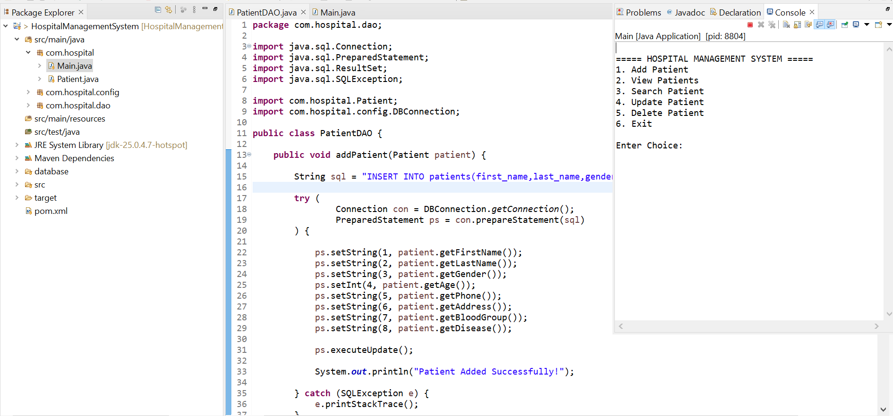
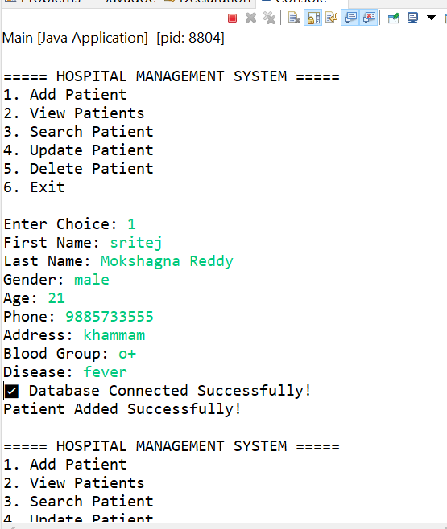
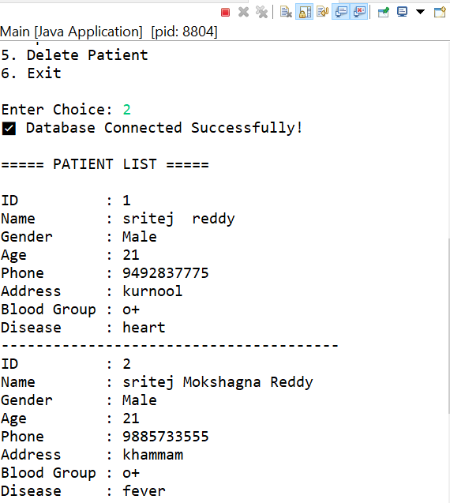
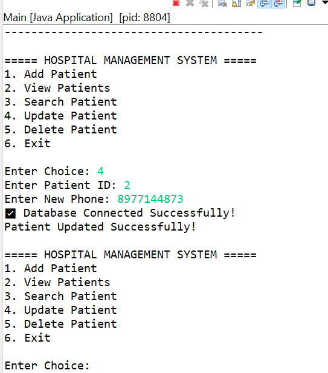
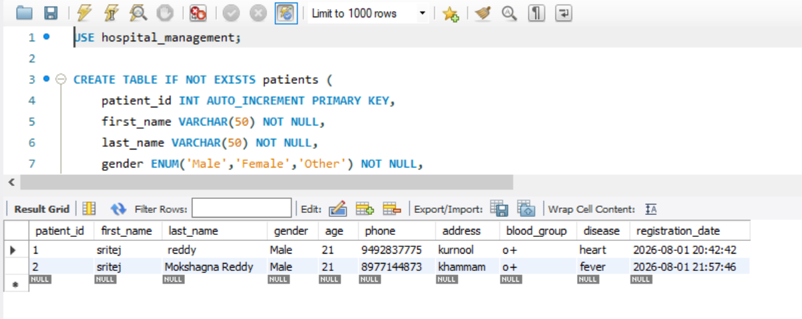

# Hospital Management System

This is a simple Hospital Management System developed using Java, JDBC, and MySQL. I built this project to improve my understanding of Java database connectivity and CRUD operations while learning backend development.

## Project Overview

The application allows users to manage hospital records through a Java desktop application connected to a MySQL database.

Users can:
- Add new patient records
- View existing patient details
- Update patient information
- Delete patient records
- Store and retrieve data from MySQL using JDBC

## Technologies Used

- Java
- JDBC
- MySQL
- Maven
- Git & GitHub

## Project Structure

```
Hospital-Management-System
│
├── database
│   └── hospital_management.sql
├── src
├── pom.xml
├── .gitignore
└── README.md
```

## Database Setup

1. Open MySQL Workbench.
2. Create a new database.
3. Run the SQL script available in the `database` folder.
4. Update the database username and password in `DBConnection.java`.
5. Run the project.

## How to Run

1. Clone this repository.
2. Open the project in IntelliJ IDEA.
3. Configure the MySQL database.
4. Build the project using Maven.
5. Run the application.

## What I Learned

While developing this project, I gained practical experience with:

- JDBC database connectivity
- CRUD operations
- MySQL database design
- Java project structure
- Maven dependency management
- Version control using Git and GitHub

## Future Improvements

Some features I would like to add in the future are:

- Doctor management
- Appointment scheduling
- Billing module
- User authentication
- Search and filtering
  
## 📸 Project Screenshots

### Home Screen


### Add Patient


### Patient Details


### Update Patient


### Delete Patient


### Database Records


### Project Output


## Author

**Sritej Mokshagna Reddy**

Thank you for visiting this repository. Feedback and suggestions are always welcome.
